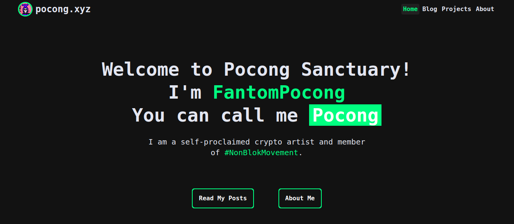

## Description

My personal blog that contains articles about my projects.

## My Repository
View it's repo here : https://github.com/fantompocong/pocong-sanctuary

## My Deployment

I deploy this project in [Vercel](https://vercel.com/). You can check it here : [https://pocong.xyz](https://pocong.xyz)

I'll keep this repository public while figuring out what I'm doing lol

You can reach me in Bahasa Indonesia and English.

---

Content below is taken from the:
## Original Repository by [albugowy15](https://github.com/albugowy15)
View it's repo here : [https://github.com/albugowy15/bughowi.com](https://github.com/albugowy15/bughowi.com)

## Tech Stack

### TypeScript

A strong typed language that make the way you write JavaScript safely. This is my first poject that I build with TypeScript. And it's really save me from getting bugs when try to get posts and project data. I have create a post about TypeScript basic concepts if you want to learn more about TypeScript basic.

### Next.js

The file system routing and SSG features is really helpful for me to create a static blog.

### Tailwind

The tailwind docs are its real magic. It is actually better documented than CSS itself. It's such a pleasure to use.

### MDX

MDX allows me to use JSX in my markdown content. I can import components, such as interactive charts or alerts, and embed them within my content. This makes writing long-form content with components a blast.

### Contentlayer

Because my post and projects is written in **MDX** files, so Contentlayer gives me a nice abstraction between my MDX files and my application. I can define document type for post and project, then get all posts and projects using `getStaticProps()` and display it using `useMDXComponent` that `next-contentlayer` provided.

## Deployment

I deploy this project in Vercel. You can check it here : [https://bughowi.com](https://bughowi.com)
